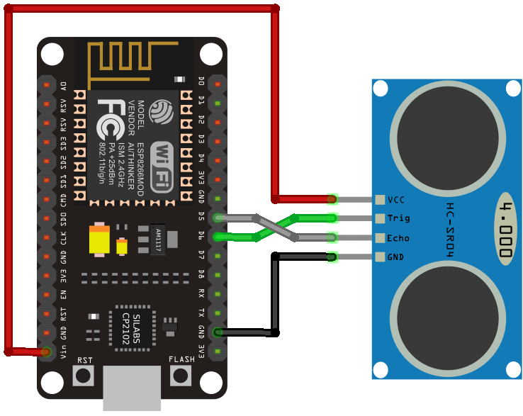

# Parking Finder

## V1.1 RELEASE

Added ConfigUpdater.exe and modified all required files to work with this program. This simplifes the project and makes it easy to run instead of manually making changes to each file. Just run ConfigUpdater.exe and enter all required information and it will update the config file according to the data you enter. 

### NOTE: [.jar , .java , .class] files for ConfigUpdater are in ConfigUpdater folder so if anyone want to run this in a different Operating System, they can update the file accordingly.

## Introduction

Welcome to **Parking Finder**, a web-based application designed to help users find nearby parking spots. This project also integrates IoT devices to provide real-time status updates on parking slot availability. The website was created by **Akash Gupta** using a combination of modern web technologies and tools.

## Project Overview

- **Website:** [Parking Finder](https://parkingfinder.host)
- **Technologies Used:**
  - HTML, CSS, JavaScript
  - PHP, MySQL
  - Mapbox API
  - PHPMailer for SMTP

## Team

Meet the team behind Parking Finder. For more details, visit our [About Us](https://parkingfinder.host/AboutUs/about) page.

## Features

- **Nearby Parking Finder:** Locate the nearest parking spots using Mapbox API integration.
- **Real-time Slot Status:** Get live updates on the availability of parking slots through IoT devices.
- **User-Friendly Interface:** Easy navigation with a sleek design.
- **Email Notifications:** Receive notifications and confirmations via email using PHPMailer.

## Installation

### Prerequisites

Before you begin, ensure you have met the following requirements:

- PHP installed on your local machine or server
- MySQL database setup
- Mapbox API Key (for map functionalities)
- PHPMailer setup for email notifications

### Clone the Repository

```bash
git clone https://github.com/AkashCS12/ParkingFinder.git
cd ParkingFinder
```

### Configuration

1. **Database Configuration:**  
   Update the database connection details in all PHP files to match your local setup.

2. **SMTP Configuration:**  
   Configure PHPMailer by updating the SMTP information in the relevant PHP files. Follow this [PHPMailer Setup Tutorial](https://youtu.be/9Db7JtLht8I?si=wrFdUYoUg4BEULwj) if needed.

3. **Mapbox API Key:**  
   Add your Mapbox API key in `index.html` and `script.js`.

## IOT Implementation

### Components Needed

1. ESP8266 NodeMCU
2. HC-SR04 Ultrasonic Sensor
3. Jumper wires (or Solder Wires)
4. Bread Board [Optional]

### Wiring Diagram

Download Arduino Sketch from Repository [Sketch](parkingfinder.ino)

1. VCC: Connect to the 3.3V pin on the NodeMCU.
2. GND: Connect to a GND pin on the NodeMCU.
3. Trig (Trigger): Connect to a digital pin on the NodeMCU, D6.
4. Echo: Connect to another digital pin on the NodeMCU, D5.




## Usage

1. Open your web browser and navigate to the project directory.
2. Register an account or log in to find nearby parking spots.
3. Check the real-time status of parking slots.
4. Receive email notifications for bookings and confirmations.

## Contributing

Contributions are welcome! Please follow the steps below to contribute:

1. Fork the repository.
2. Create a new branch (`git checkout -b feature-branch`).
3. Make your changes.
4. Commit your changes (`git commit -m 'Add new feature'`).
5. Push to the branch (`git push origin feature-branch`).
6. Create a Pull Request.

## Credits

- **PHPMailer:** This project uses [PHPMailer](https://github.com/PHPMailer/PHPMailer) for sending emails. Credit goes to the PHPMailer team for their work on this amazing library.
- **Mapbox:** The map functionalities are powered by [Mapbox](https://www.mapbox.com/). A big thanks to the Mapbox team.
- **YouTube Video Tutorial:** Special thanks to the creator of [this PHPMailer setup tutorial](https://youtu.be/9Db7JtLht8I?si=wrFdUYoUg4BEULwj) on YouTube.
- **Other Libraries and Tools:** Credit to all the open-source libraries and tools used in this project.

## License

This project is open-source and available under the [MIT License](LICENSE).
